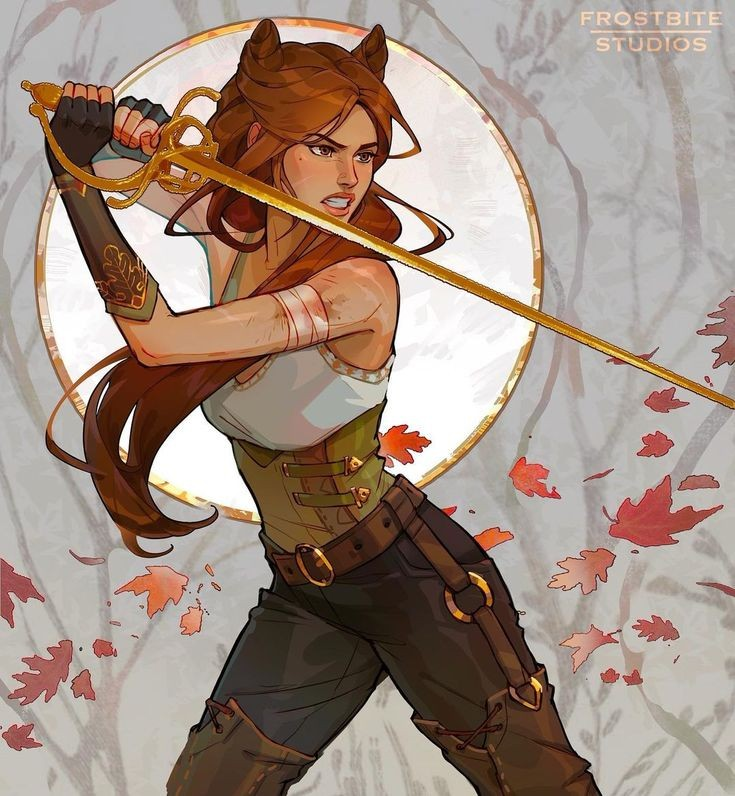
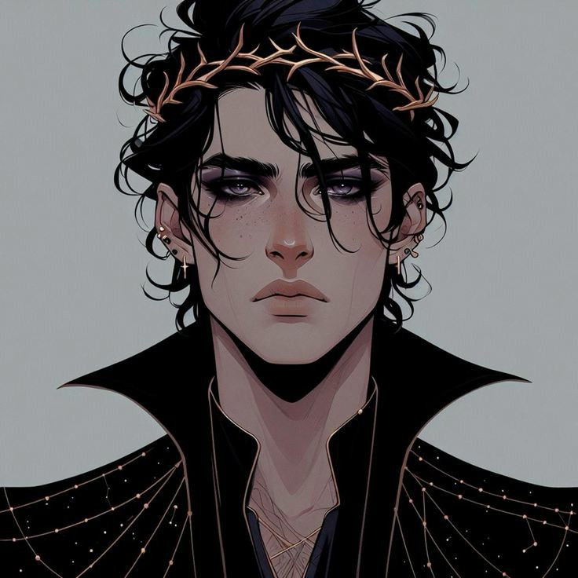
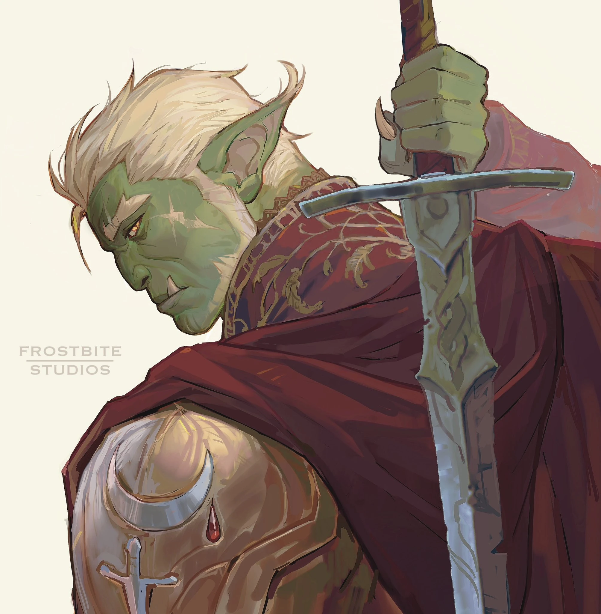
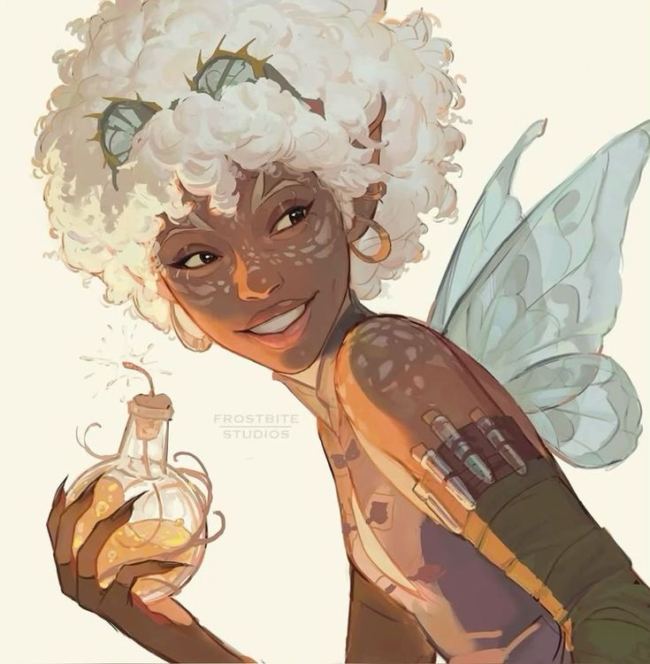
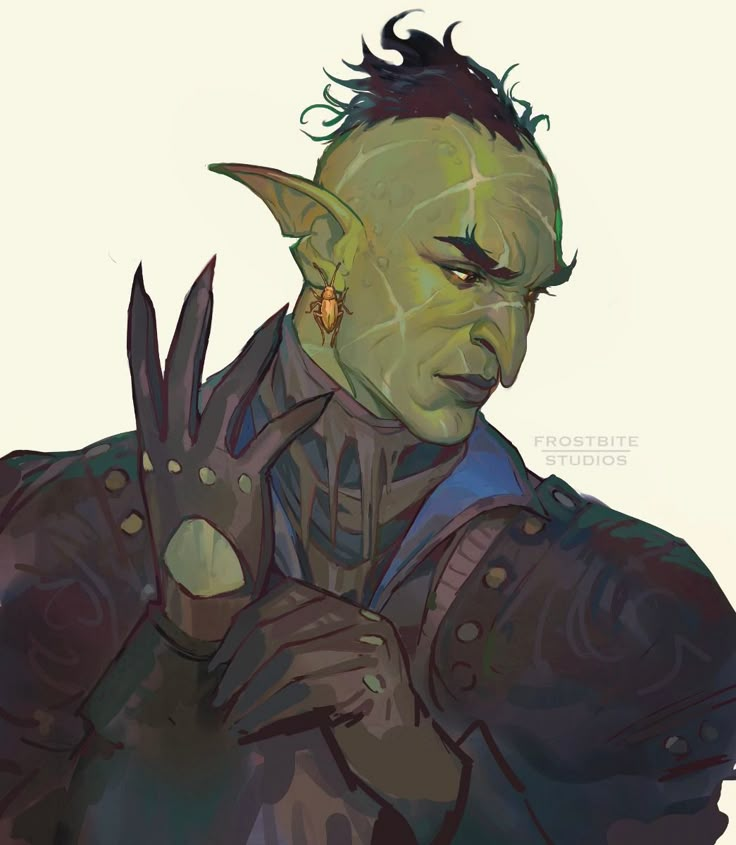
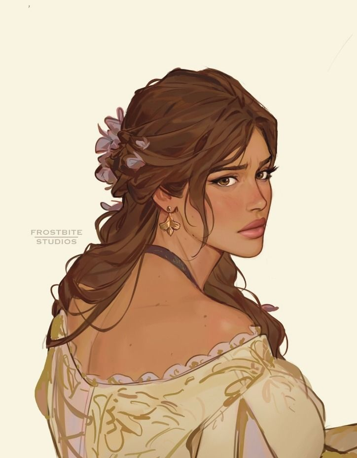

<h1>Desafio de projeto do Felipão: Mario Kart.JS</h1>

  <table>
        <tr>
            <td>
                
            </td>
            <td>
                <b>Objetivo:</b>
                
Mario Kart é uma série de jogos de corrida desenvolvida e publicada pela Nintendo. Nosso desafio será criar uma lógica de um jogo de vídeo game para simular corridas de Mario Kart, levando em consideração as regras e mecânicas abaixo.

            </td>
        </tr>
    </table>

<h2>Players</h2>
<table style="border-collapse: collapse; width: 800px; margin: 0 auto;">
  <tr>
    <td style="border: 1px solid black; text-align: center;">
      
Jude

      
    </td>
    <td style="border: 1px solid black; text-align: center;">
      
Velocidade: 4

      
Força: 4

      
Resistencia: 4

    </td>

<td style="border: 1px solid black; text-align: center;">
      
Cardan

      
    </td>
    <td style="border: 1px solid black; text-align: center;">
      
Velocidade: 5

      
Força: 3

      
Resistencia: 4

    </td>

<td style="border: 1px solid black; text-align: center;">
      
Madoc

      
    </td>
    <td style="border: 1px solid black; text-align: center;">
      
Velocidade: 3

      
Força: 5

      
Resistencia: 4

    </td>
  </tr>

  <tr>
    <td style="border: 1px solid black; text-align: center;">
      
Bomba

      
    </td>
    <td style="border: 1px solid black; text-align: center;">
      
Velocidade: 4

      
Força: 3

      
Resistencia: 5

    </td>

<td style="border: 1px solid black; text-align: center;">
      
Barata

      
    </td>
    <td style="border: 1px solid black; text-align: center;">
      
Velocidade: 5

      
Força: 2

      
Resistencia: 5

    </td>

<td style="border: 1px solid black; text-align: center;">
      
Taryn

      
    </td>
    <td style="border: 1px solid black; text-align: center;">
      
Velocidade: 3

      
Força: 4

      
Resistencia: 5

    </td>
  </tr>
</table>

<h3>🕹️ Regras & mecânicas:</h3>

<b>Jogadores:</b>

<input type="checkbox" />
<label>O computador deve receber dois personagens para disputar a luta, cada um com seus atributos próprios</label>

<b>Rodadas:</b>

<ul>
  <li><input type="checkbox" /> <label>A luta acontece em 5 rodadas</label></li>
  <li><input type="checkbox" /> <label>A cada rodada, será sorteado um tipo de evento: DESVIAR, RESISTENCIA ou CONFRONTO</label>
    
    
 <li><input type="checkbox" /> <label><b>DESVIAR:</b> Os dois jogadores rolam um dado de 6 lados e somam com o atributo VELOCIDADE. Quem tiver o maior resultado ganha 1 ponto.</label></li>
      
 <li><input type="checkbox" /> <label><b>RESISTENCIA:</b> Cada jogador rola um dado de 6 lados e soma com RESISTENCIA. Caso o resultado seja maior ou igual a 6, o jogador ganha 1 ponto. Esse evento é individual (os dois podem ganhar ponto).</label></li>
      
  <li><input type="checkbox" /> <label><b>CONFRONTO:</b> O jogador 1 ataca somando FORÇA com o dado, enquanto o jogador 2 defende somando RESISTENCIA. Se o ataque for maior, o defensor perde 1 ponto. Em seguida ocorre um contra-ataque, invertendo os papéis.</label></li>
      

  </li>
</ul>

<b>Condição de vitória:</b>

<input type="checkbox" />
<label>Ao final das 5 rodadas, vence quem tiver mais pontos acumulados</label>